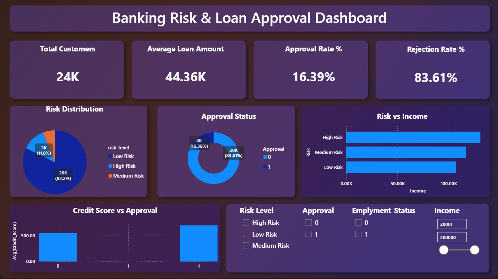

# Banking-Risk-Analysis-Reporting-Dashboard

## 🚀 Overview

This project analyzes banking loan data to identify **high-risk customers** and evaluate **loan approval patterns** using **SQL, Python, and Power BI**.

The primary objective is to enable **risk-based decision-making** by examining key financial indicators such as income, credit score, loan amount, and debt-to-income (DTI) ratio.

---

## 📸 Dashboard Preview

---

## 🎯 Objectives

- Identify customers with **high probability of default**
- Analyze **loan approval vs rejection trends**
- Build **MIS-style dashboards** for reporting
- Generate **actionable business insights** for risk management

---

## 🧱 Tech Stack

- **SQL (PostgreSQL)** – Data extraction, transformation, and analysis  
- **Python (Pandas, NumPy)** – Data cleaning and exploratory data analysis  
- **Power BI** – Interactive dashboard and visualization  
- **Excel** – Initial data inspection  

---

---

## 📊 Dashboard Features

### 🔹 Key Metrics
- Total Customers  
- Approval Rate (%)  
- Rejection Rate (%)  
- Average Loan Amount  

### 🔹 Risk Analysis
- Risk Level Distribution (High / Medium / Low)  
- DTI Ratio vs Risk  
- Income vs Risk  

### 🔹 Approval Analysis
- Loan Approval vs Rejection  
- Credit Score vs Approval  
- Loan Amount vs Approval  

### 🔹 Filters (Slicers)
- Risk Level  
- Employment Status  
- Income Range  

---

## 🧠 Key Insights

- Customers with **high DTI ratio** show significantly higher default risk  
- **Low-income groups** have higher loan rejection rates  
- **Credit score** is a strong predictor of loan approval  
- **Employment status** influences both risk level and approval probability  

---

## ⚙️ Workflow

1. **Data Collection**
   - Imported dataset from Kaggle  

2. **Data Cleaning**
   - Handled missing values  
   - Removed duplicates  
   - Standardized formats  

3. **Exploratory Data Analysis (EDA)**
   - Identified trends and correlations  

4. **SQL Analysis**
   - Risk segmentation  
   - Approval rate calculation  
   - KPI extraction  

5. **Dashboard Development**
   - Built interactive Power BI dashboard  
   - Added KPIs, charts, and slicers  

---

